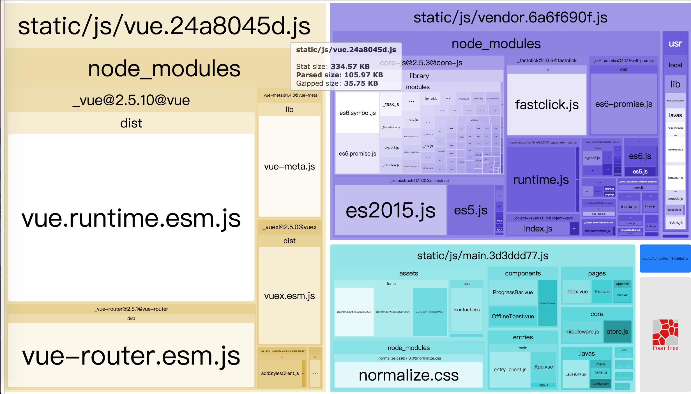

# 构建配置

从本篇文档开始，我们将介绍 Lavas 构建、运行中使用的配置项。开发者可以在项目根目录下的 `lavas.config.js` 中定义这些配置项。配置对象的结构大致如下：
```javascript
// lavas.config.js

{
    build: {},
    router: {},
    middleware: {},
    // 省略其他配置项
}
```

Lavas 内部使用 [Webpack](https://doc.webpack-china.org/concepts/) 进行构建，众所周知 Webpack 功能强大但是配置非常复杂，我们隐藏了大部分构建细节，将构建流程中部分常用特性以配置项的形式暴露给用户，便于快速上手。同时，对于高级开发者，也能通过特殊的配置项将自定义的 Loader 和 Plugin 加入构建流程。

这些在构建过程中使用的 Webpack 相关配置项将放在 `build` 下，下面我们将依次介绍这些配置项。
```javascript
// lavas.config.js

build: {
    ssr: true,
    path: '',
    publicPath: '',
    // 省略其他配置项
}
```

## ssr

切换 SPA 单页应用和 SSR 服务端渲染两种编译模式。
```javascript
ssr: true // SSR 模式
```

## path

最终构建产物的输出地址，必须为绝对路径。如下配置将输出构建产物到 `dist` 文件夹下：
```javascript
path: path.resolve(__dirname, 'dist')
```
等同于 Webpack 配置中的 [output.path](https://doc.webpack-china.org/configuration/output/#output-path)。

## publicPath

在静态资源路径之前添加的前缀。默认值为 `'/'`。
```javascript
publicPath: '/'
```

例如在使用 CDN 场景下，可以使用如下配置：
```javascript
publicPath: '//cdn.example.com/assets/'
```

更多使用例子可参考 Webpack 配置中的 [output.publicPath](https://doc.webpack-china.org/configuration/output/#output-publicpath)。

## filenames

Webpack 可以指定输出静态资源（JS CSS FONT IMG）的文件名，其中可以使用例如 `[hash]` 这样的模板字符串。
Lavas 中使用的默认值如下：
```javascript
filenames: {
    entry: 'js/[name].[chunkhash:8].js',
    vue: 'js/vue.[chunkhash:8].js',
    vendor: 'js/vendor.[chunkhash:8].js',
    chunk: 'js/[name].[chunkhash:8].js',
    css: 'css/[name].[contenthash:8].css',
    img: 'img/[name].[hash:8].[ext]',
    fonts: 'fonts/[name].[hash:8].[ext]'
}
```

其中：

* **entry** entry chunk。将影响各个入口文件名。 可参考 Webpack 中的 [output.filename](https://doc.webpack-china.org/configuration/output/#output-filename)。
* **vue** 我们将 Vue 相关的依赖合并成一个 chunk。包括 vue、vue-router、vuex 和 vue-meta。
* **vendor** 包含其他第三方依赖。
* **chunk** async chunk。将影响非入口文件名。可参考 Webpack 中的 [output.chunkFilename](https://doc.webpack-china.org/configuration/output/#output-chunkfilename)。
* **css** 样式文件。由于使用了 [ExtractTextWebpackPlugin](https://doc.webpack-china.org/plugins/extract-text-webpack-plugin)从 JS 中提取样式，必须使用 `[contenthash]` 而非 `[hash]` 或者 `[chunkhash]`。
* **img** 图片。
* **fonts** 字体文件。

更多模板字符串示例及其使用场景可以参考 Webpack [output.filename](https://doc.webpack-china.org/configuration/output/#output-filename)。

## babel

Lavas 内部配置 Webpack 规则，使用 `babel-loader` 处理 JS 文件。通过 `babel` 这个配置项可以指定包括 babel preset 和 plugin 在内的很多属性，更多可配置属性可以参考 [`babel-loader options`](https://github.com/babel/babel-loader#options)。

Lavas 默认使用 [vue-app](https://github.com/vuejs/babel-preset-vue-app) 这个 preset，其中已经包含了一系列 babel 插件，在大多数情况下已经能满足 Vue 项目的开发：
```javascript
babel: {
    presets: ['vue-app']
}
```

但有时我们也需要进行额外的配置，例如在下面使用 [vuetify](https://vuetifyjs.com/) 的场景中，我们需要配置一系列 plugins 以支持组件的按需加载功能：
```javascript
babel: {
    presets: ['vue-app'],
    plugins: [
        "transform-runtime",
        ["transform-imports",
            {
                "vuetify": {
                    "transform": "vuetify/es5/components/${member}",
                    "preventFullImport": true
                }
            }
        ]
    ],
    babelrc: false
}
```

注意，虽然我们能够通过 `babel` 配置项对 `babel-loader` 进行配置，按说项目根目录下的 `.babelrc` 就不再需要了，但我们仍然要保留这个文件，原因是 `vue-loader` 必须要通过 `.babelrc` 才能进行配置。

## cssExtract

在使用 [ExtractTextWebpackPlugin](https://doc.webpack-china.org/plugins/extract-text-webpack-plugin)从 JS 中提取样式时，需要设置 Loader 和 Plugin。由于分离样式会造成额外的编译开销，Lavas 默认在开发模式中关闭这一特性，在生产环境打开。
```javascript
cssExtract: true
```

## cssMinimize & cssSourceMap

是否需要对 CSS 文件进行压缩以及生成 source-map。
```javascript
cssMinimize: true,
cssSourceMap: true
```

这两个参数最终将传递给 [css-loader](https://github.com/webpack-contrib/css-loader)。
```javascript
loader: 'css-loader',
options: {
    minimize: true,
    sourceMap: true
}
```

## jsSourceMap

是否需要对 JS 文件生成 source-map，便于开发模式调试以及生产环境排查错误，默认开启。
```javascript
jsSourceMap: true
```

Webpack 支持通过 `devtool` 配置项生成多种 [source-map](https://doc.webpack-china.org/configuration/devtool/)。这些不同格式的 source-map 在生成速度，是否内联在源文件中等等方面都有显著差异，需要使用者根据具体场景选择合适的格式。
在开发模式中，由于代码经常发生变动，我们通常会选择生成速度快，可以接受内联从而增加源文件体积的代价。而在生产环境中，我们通常选择生成独立的 source-map 文件，此时生成速度就可以忽略了。

在 Lavas 中开启这个配置后将作用于以下两种场景：

1. 开发模式中选择 `cheap-module-eval-source-map`。这种格式只显示行号不显示列号，重新生成速度很快。
2. 生产环境中选择 `nosources-source-map`。这种格式下生成的独立 source-map 不会暴露源文件内容，只会显示错误堆栈信息。同时通过 [UglifyJsPlugin](https://doc.webpack-china.org/plugins/uglifyjs-webpack-plugin) 在压缩 JS 文件的同时生成 sourceMap，内部通过设置插件的 [sourcemap 选项](https://doc.webpack-china.org/plugins/uglifyjs-webpack-plugin/#sourcemap)实现。

## bundleAnalyzerReport

[Webpack Bundle Analyzer](https://github.com/webpack-contrib/webpack-bundle-analyzer) 提供了可视化图表这样的直观方式，帮助开发者分析构建产物中可能出现的问题，例如重复引入、不必要的依赖。
```javascript
// 默认配置，启动 localhost:8888 服务器展示网页
bundleAnalyzerReport: true

// 自定义配置
bundleAnalyzerReport: {
    analyzerMode: 'server',
    analyzerHost: '127.0.0.1',
    analyzerPort: 8888,
    // 省略其他配置
}
```

Lavas 默认关闭这一配置。开启后，运行 `lavas build`，将自动启动服务器并打开网页，以下是 Lavas 模板项目的分析结果：


## defines

在构建时我们常常需要使用全局常量，在 Webpack 中可以通过 [DefinePlugin](https://doc.webpack-china.org/plugins/define-plugin/) 插件定义这些常量。Lavas 提供三组命名空间，分别是 SSR 中服务端使用的 `server`，客户端使用的 `client` 以及两者共用的 `base`。另外需要注意的是常量的值必须包含字符串本身内的实际引号，可以使用单引号包含双引号或者 `JSON.stringify()`。
```javascript
defines: {
    base: {
        'MY_CONSTANT': '"VALUE"'
    },
    client: {},
    server: {}
}
```

一个常见的使用场景是，需要根据开发环境和生产环境定义不同的 URL。由于在启动 Lavas 时已经设置了环境变量 `process.env.NODE_ENV`，在 `lavas.config.js` 中可以这样做：
```javascript
// lavas.config.js
const isProd = process.env.NODE_ENV === 'production';

defines: {
    base: {
        PASSPORT_URL: isProd
            ? JSON.stringify('https://wappass.example.com/passport')
            : JSON.stringify('https://wappass.qatest.example.com/passport')
    }
}
```

另外，Lavas 已经内置了以下两组全局常量 `process.env.VUE_ENV` 和 `process.env.NODE_ENV`，可以直接在项目中使用，不需要开发者重复定义：
```javascript
// 在同构应用当前处于 client 或者 server 端
'process.env.VUE_ENV': '"client"',

// 当前应用处于开发模式 development 或者生产模式 production
'process.env.NODE_ENV': '"development"'
```

## alias

在 Webpack 中解析模块时，我们常常使用 alias 定义路径的[简写别名](https://doc.webpack-china.org/configuration/resolve/#resolve-alias)，便于更加简便地引用模块。

Lavas 提供了 `alias` 下三组命名空间，分别是 SSR 中服务端使用的 `server`，客户端使用的 `client` 以及两者共用的 `base`。
```javascript
alias: {
    base: {},
    client: {},
    server: {}
}
```

另外，Lavas 已经内置了两组别名，开发者不需要重复定义。例如如果想引用项目根目录下 `components` 文件夹中的组件，只需要使用 `import MyComponent from '@/components/MyComponent'`：
```javascript
'@': '' // 指向项目根目录,
'$': '' // 指向 .lavas 目录
```

## plugins

在使用 Webpack 构建时，各种插件是必不可少的，对于开发者自定义的插件，Lavas 提供了 `plugins` 下三组命名空间，分别是 SSR 中服务端使用的 `server`，客户端使用的 `client` 以及两者共用的 `base`。有一点需要注意，自定义插件将添加到 Lavas 已有插件列表之后，如果对于插件添加顺序有要求，可以参考 `extend` 配置项，进行更精确的添加。
```javascript
plugins: {
    base: [],
    client: [],
    server: []
}
```

## extend

为了给予开发者更大的灵活度，能自由修改 Webpack 配置对象，Lavas 提供了 `extend` 方法。
该方法参数说明如下：
* `config` Webpack 配置对象。
* `options.type` Webpack 配置对象类型，一共有三种：`client` 供客户端使用，`server` 供服务端使用，`base` 使两者同时生效。
* `options.env` 当前构建环境变量，取值有两种：`development|production`。

例如我们想增加 `vue-style-variables-loader` 来处理 `.vue` 文件，可以这么做：
```javascript
extend(config, {type, env}) {
    // 在客户端和服务端同时生效，等同于 type === 'client' || type === 'server'
    if (type === 'base') {
        let vueRule = config.module.rules[0];
        vueRule.use.push({
            loader: 'vue-style-variables-loader',
            options: {
                variablesFiles: [
                    path.join(__dirname, 'assets/styles/variables.styl')
                ]
            }
        });
    }
}
```

> info
>
> `extend` 方法适合对于 Webpack 配置对象进行简单扩展的场景，例如添加插件。如果需要对 Lavas 内置的规则和插件进行修改，可以参考下面的 `extendByWebpackChain` 方法。

## extendWithWebpackChain

> info
>
> 该方法在 lavas-core-vue@1.0.8 版本引入，同时由于使用了 webpack-chain 依赖，要求 Node 版本 > 6.9.0。

使用上面提到的 `extend` 方法直接修改 Webpack 配置对象，对于熟悉 Webpack 文档的开发者会比较直观。但是在以下场景下存在局限性：
1. **修改 Lavas 已有规则**。由于 Webpack 配置对象层次很深，尤其是访问数组类型的配置项时只能以索引方式。例如 Lavas 内置了 vue-loader 处理 `.vue` 文件，如果使用 `extend` 方法试图访问并修改，只能通过 `config.module.rules[0].use[0].options.loader` 这样的方法，十分繁琐。
2. **控制自定义插件的顺序**。开发者对于 Lavas 内部使用的插件缺少便捷的引用方式，因此无法插入新插件到某个特定插件前后。另外，如果想删除 Lavas 内置的某个插件，也只能通过索引方式访问插件数组。
3. **干预 Lavas 内置插件的初始化创建**。对于 Lavas 内置的插件，一旦用户希望修改传入这个插件构造函数的参数，使用 `extend` 是无法做到的，因为调用 `extend` 时插件已经由 Lavas 初始化完成。

而使用 `extendWithWebpackChain` 可以解决上述三个问题，方法参数和 `extend` 相同。

### 扩展 Lavas 内置规则及 Loader

首先，我们给 Lavas 内置的所有规则设置了名称，某条规则应用的任何一个 Loader 都可以通过 `config.rule(规则名称).use(Loader 名称)` 方式引用，并使用 [tap](https://github.com/mozilla-neutrino/webpack-chain#config-module-rules-uses-loaders-modifying-options) 方法对传入 Loader 的参数进行扩展：
```javascript
extendWithWebpackChain: (config, {type, env}) => {
    // 扩展 babel-loader，添加一个 babel 插件
    config.module
        .rule('js')
            .use('babel')
            .tap(options => merge(options, { plugins: ['babel-plugin-syntax-object-rest-spread'] }));
}
```

Lavas 内置的全部规则及对应 Loader 如下：

| 规则 | Loader 名称 | 说明 |
| --- | --- | --- |
| vue | vue | 匹配 `/\.vue$/` 规则 |
| js | babel | 匹配 `/\.js$/` 规则，默认使用 [vue-app](https://github.com/vuejs/babel-preset-vue-app) preset |
| img | url | 处理 `.png .jpe?g .gif .svg` |
| font | url | 处理 `.woff2 .eot .ttf .otf` |
| style-css | css | 匹配 `/\.css$/` 规则 |
| style-postcss | css | --- |
| style-less | css less vue-style | 匹配 `/\.less$/` 规则，依次通过 css less 和 vue-style 这三个 Loader 处理，下同 |
| style-sass | css sass vue-style | 匹配 `/\.sass$/` 规则 |
| style-scss | css sass vue-style | 匹配 `/\.scss$/` 规则 |
| style-stylus | css stylus vue-style | 匹配 `/\.stylus$/` 规则 |
| style-styl | css stylus vue-style | 匹配 `/\.styl$/` 规则 |

### 扩展 Lavas 内置插件

其次，我们给 Lavas 内部使用的所有插件也设置了名称，可以通过 `config.plugin(name)` 方式访问，通过以下方法可以对插件进行便捷地修改：
* [init](https://github.com/mozilla-neutrino/webpack-chain#config-plugins-modify-instantiation) 扩展已有插件初始化参数
* [use](https://github.com/mozilla-neutrino/webpack-chain#config-plugins-adding) 添加新插件
* [after/before](https://github.com/mozilla-neutrino/webpack-chain#config-plugins-ordering-after) 控制新插件添加到已有插件前后

```javascript
extendWithWebpackChain: (config, {type, env}) => {
    // 在 friendly-error 插件创建时扩展自定义参数
    config.plugin('friendly-error').init((Plugin, args) => {
        let customParams = {}; // 扩展传入插件构造函数的参数
        return new Plugin(...args, customParams)
    });

    // 添加第三方插件到指定 Lavas 内置 html 插件之后
    config.plugin('my-plugin').after('html').use(MyPlugin);
}
```

以下是 Lavas 内置的部分插件列表：

| 插件名称 | client/server | 开发/生产环境 | 说明 |
| --- | --- | --- | --- |
| define | client & server | 开发 & 生产 | [DefinePlugin](https://doc.webpack-china.org/plugins/define-plugin/)，可以通过 [`build.defines`](https://lavas.baidu.com/guide/v2/advanced/build-config#defines) 进行扩展。 |
| html | client | 开发 & 生产 | [HtmlWebpackPlugin](https://doc.webpack-china.org/plugins/html-webpack-plugin/)，用于在 SPA 模式下生成 HTML。 |
| skeleton | client | 开发 & 生产 | [VueSkeletonWebpackPlugin](https://github.com/lavas-project/vue-skeleton-webpack-plugin)，用于在 SPA 模式下向 HTML 中注入 Skeleton。 |
| chunk-vendor | client | 开发 & 生产 | [CommonsChunkPlugin](https://doc.webpack-china.org/plugins/commons-chunk-plugin/)，创建包含第三方依赖的 chunk |
| chunk-vue | client | 开发 & 生产 | 包含 vue，vuex，vue-router 和 vue-meta |
| chunk-manifest | client | 开发 & 生产 | 仅包含 Webpack 运行时代码 |
| hot-module-replacement | client | 开发 | 代码热更新相关 |
| no-emit-on-errors | client | 开发 | 出错时终止编译流程 |
| progress-bar | client | 开发 | [ProgressBarWebpackPlugin](https://github.com/clessg/progress-bar-webpack-plugin)，展示构建进度条 |
| friendly-error | client | 开发 | [FriendlyErrorsWebpackPlugin](https://github.com/geowarin/friendly-errors-webpack-plugin)，友好地展示错误信息 |
| extract-css | client & server | 生产 | [ExtractTextWebpackPlugin](https://doc.webpack-china.org/plugins/extract-text-webpack-plugin/)，默认在开发模式关闭，生产环境开启。可以通过[`build.cssExtract`](https://lavas.baidu.com/guide/v2/advanced/build-config#cssextract)配置。 |
| module-concatenation | client & server | 生产 | [ModuleConcatenationWebpackPlugin](https://doc.webpack-china.org/plugins/module-concatenation-plugin/)，实现预编译功能 |
| hashed-module-ids | client & server | 生产 | [HashedModuleIdsWebpackPlugin](https://doc.webpack-china.org/plugins/hashed-module-ids-plugin/)，根据模块的相对路径生成模块 id |
| optimize-css | client & server | 生产 | [OptimizeCSSPlugin](https://github.com/NMFR/optimize-css-assets-webpack-plugin)，样式去重压缩 |
| uglify-js | client & server | 生产 | [UglifyjsWebpackPlugin](https://doc.webpack-china.org/plugins/uglifyjs-webpack-plugin/)，JS 压缩 |
| workbox | client | 生产 | [WorkboxWebpackPlugin](https://github.com/GoogleChrome/workbox)，使用 2.x 版本，用于生成 ServiceWorker 文件 |
| sw-register | client | 生产 | [SWRegisterWebpackPlugin](https://github.com/lavas-project/sw-register-webpack-plugin)，用于向 HTML 中注入 ServiceWorker 注册代码 |

### 更多示例

上面列出了最常用的对于 Webpack 的扩展，即修改 Loader 和 插件，其余配置项的使用方法，可以参考 [webpack-chain API](https://github.com/mozilla-neutrino/webpack-chain)。

另外，我们编写了一个简单的 [Codelab](https://lavas.baidu.com/codelab/eslint/)，使用 `extendWithWebpackChain` 方法配合 ESlint 为 Lavas 项目增加代码检查。

## compress

> info
>
> 该配置项只有 SSR 模式下生效，SPA 模式下可以忽略。

在 SSR 模式下是否启用 gzip，通过内置的 [compress 中间件](https://github.com/expressjs/compression)实现。Lavas 默认在开发模式中关闭这一特性，在生产环境打开。
```javascript
compress: false
```

## nodeExternalsWhitelist

> info
>
> 该配置项只有 SSR 模式下生效，SPA 模式下可以忽略。

在 SSR 模式下，通常我们不希望将 `node_modules` 中的依赖打包进 server bundle 中，因此需要使用 Webpack [externals](https://doc.webpack-china.org/configuration/externals/) 配置项。Lavas 已经通过 [Webpack node modules externals](https://github.com/liady/webpack-node-externals) 将 `node_modules` 全部排除。但是在某些场景下，我们还是需要将部分特定的依赖打包进来，这时就需要使用[白名单](https://github.com/liady/webpack-node-externals#optionswhitelist-)了：
```javascript
nodeExternalsWhitelist: []
```

例如在服务端渲染场景下常常遇到的一个问题是，某些第三方依赖使用了 `document`, `window` 这样在 Node.js 环境中不存在的对象。为了保证服务端渲染正常运行，通常使用 `resolve.alias` 引导 Webpack 使用空的 stub 对象，此时一定要同时在 `nodeExternalsWhitelist` 中加入该依赖。

## ssrCopy

> info
>
> 该配置项只有 SSR 模式下生效，SPA 模式下可以忽略。

在 SSR 模式下，Lavas 除了将构建产物输出到例如 `dist` 文件夹中，还可以将例如 `node_modules`，线上脚本等文件拷贝到里面。这样 `dist` 文件夹可以作为一个可单独运行的包，移动到任意位置：
```javascript
ssrCopy: isDev ? [] : [
    {
        src: 'server.prod.js'
    },
    {
        src: 'node_modules'
    },
    {
        src: 'package.json'
    }
]
```

虽然从功能上看都是拷贝文件，但是这些文件并不会经过 CopyWebpackPlugin 处理，这一点不同于 `/static` 文件夹。

## watch

Lavas 在开发模式下使用了 webpack-dev-middleware。得益于自带的热加载功能，很多源文件的修改会自动触发 Webpack 重新编译，不需要开发者重启开发服务器。Lavas 扩充了这个功能，修改以下文件，也会触发重新编译：

* `/pages` 下增加删除修改路由组件。
* `lavas.config.js` 配置内容发生修改。
* SSR 模式下模板内容发生修改。

整个重新编译过程中不需要开发者关闭重启服务，也就是说从 MPA 模式切换到 SSR 模式也只需要修改配置后等待编译完成。另外，如果想监控自定义文件、文件夹，在它们发生修改时也触发重新编译，可以通过 `watch` 配置项传入文件列表：
```javascript
watch: [
    '/foo/bar' // 自定义文件
]
```

## development & production

对于以上配置项，如果需要在开发模式和生产环境启用不同的值，可以使用两个特殊的配置项 `development` 和 `production`。
例如想在开发模式关闭 `cssExtract` 分离样式而在生产环境开启，可以这么做：
```javascript
build: {
    // 省略其他配置项
},
development: {
    build: {
        cssExtract: false
    }
},
production: {
    build: {
        cssExtract: true
    }
}
```
