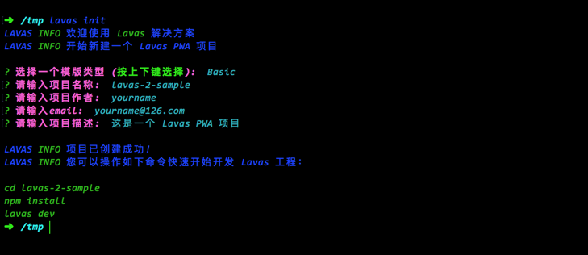
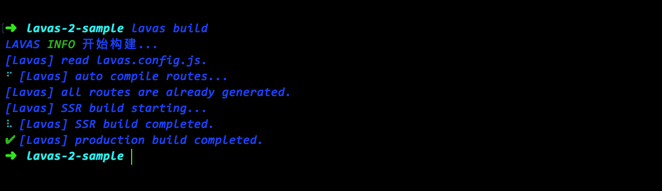
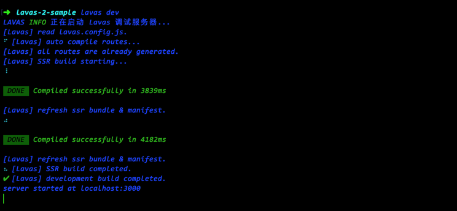
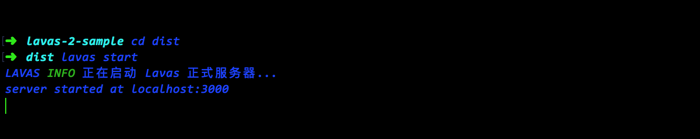

# Lavas 命令介绍

开发者如果已经尝试过 Codelab 中“开发第一个 Lavas 应用”的[环境准备](/codelab/get-started/prepare)步骤，相信对于命令 `lavas init` 有所了解了。包括这条命令在内，这里将向开发者介绍 Lavas 集成的所有便捷命令。

## lavas init

同样在 Codelab 已经提过，使用 `lavas init` 命令进行项目的初始化，效果如下：

## lavas build

使用 Lavas 对项目进行构建，内部会调用 babel, webpack 等，最终生成在 `/dist/` 目录中 (可以通过 `/lavas.config.js` 进行修改)，效果如下：

更多关于构建的信息可以参见[构建部署工程](/guide/v2/basic/build)和[Lavas 中的 build 配置](/guide/v2/advanced/build)

## lavas dev

使用 Lavas 内置的调试服务器启动 Lavas 项目，方便开发者进行调试。调试服务器还包含了热加载 (hotreload) 功能，修改绝大部分的文件(如 `/pages/`, `/store/` 等)均__不__需要重启服务器，效果如下：

此外为了防止 Service Worker 的缓存对频繁改动的开发调试阶段产生影响，使用 `lavas dev` 启动的调试服务器__不会__注册 Service Worker。

## lavas start

使用 Lavas 内置的正式服务器启动__服务端渲染__的 Lavas 项目。一般来说开发者在运行了 `lavas build` 之后，切换到生成目录(默认是 `/dist/`)中使用命令 `npm install` 和 `lavas start` 可以预览线上效果。在这种模式下，所有的代码均经过了 babel 转码和 webpack 压缩，并且 Service Worker 也会被注册，使用 localhost 访问即可预览效果。

## lavas static

使用 Lavas 内置的静态服务器以当前目录为基准启动。用法有两种：

* 在 __构建后的__ Lavas __SPA__ 项目(默认 `/dist/`)启动

    SPA 项目在构建后没有 `server.prod.js` 这类服务器文件，因此无法快速启动预览效果。开发者除了配置转发服务器 (如 nginx, koa, express 等) 之外，也可以通过 `lavas static` 命令快速启动。
    在这种模式下，所有的代码均经过了 babel 转码和 webpack 压缩，并且 Service Worker 也会被注册，使用 localhost 访问即可预览带有 Service Worker 的站点效果。

    

* 在任何其他目录启动

    以当前目录为基准启动一个简单的静态服务器，可以访问目录内的所有静态资源，供各类调试/传递文件使用。作为一个开发工具，不仅仅局限于 Lavas。
