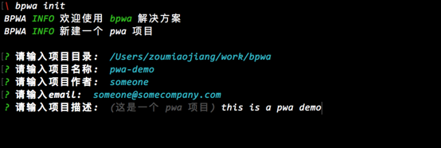

# 快速开始 PWA 工程

我们为开发 PWA 工程提供了一套 cli 脚手架工具，协助我们快速搭建一个 基于 Vue 的 PWA 工程，并且迅速体验 PWA 效果。

## 准备

本地安装最新版本的 Node.js

- Node.js：[https://nodejs.org/](https://nodejs.org/en/)

学习 Vue 相关知识

- Vue: [https://cn.vuejs.org](https://cn.vuejs.org)
- Vuex: [https://vuex.vuejs.org/zh-cn](https://vuex.vuejs.org/zh-cn)
- Vue-router: [https://router.vuejs.org/zh-cn](https://router.vuejs.org/zh-cn)

学习 pwa 相关知识

- PWA: [https://pwa.baidu.com/doc](https://pwa.baidu.com/doc)


## 依赖工具

如果想在本地开发 PWA 工程，从 0 开始开发一个基于 Vue 的 PWA 项目是非常困难的，我们还有很多除了业务实现之外的事情需要做。为了节省大家在业务之外减少开发时间，我们提供了一套命令行工具 --- lavas-cli。目前 lavas-cli 提供了脚手架初始化工作，能够帮助我们在正式开发之前做好充分准备。

可以通过以下方式 npm 安装 lavas-cli：

```npm
[sudo] npm install -g lavas-cli
```

## 初始化工程

执行以下命令可以初始化 PWA 工程：

```npm
lavas init
```




## 目录结构

通过初始化命令，可以在 `项目存储目录` 下找到我们新建的项目 `pwa-demo` 文件夹。

```
pwa-demo/ (项目根目录)
    | - build/ (Webpack 和 dev-server 相关调试和构建配置文件)
    | - config/ (通用模块配置)
    | - src/ (源代码)
        | - api/ (Ajax 异步请求接口)
        | - app-shells/ (App-shells Components)
        | - assets/ (依赖的静态资源)
        | - components/ (业务开发的 Vue Component)
        | - filters/
        | - mixins/
        | - pages/ (具体业务开发的 Page 页面 Component)
        | - store/ (Vuex store)
        | - app.js (Vue 入口执行文件)
        | - App.vue (项目的根 Component)
        | - client-entry.js (前端渲染入口文件)
        | - event-bus.js
        | - router.js (Vue-router 路由配置文件)
        | - skeleton-entry.js (skeleton 渲染入口)
        | - svg.js (自定义 SVG 配置)
        | - sw-register.js (注册 service worker 文件入口)
    | - static/ (不需要经过构建的一些静态资源)
    | - index.html
    | - package.json

```

项目目录结构我们参照的基础是 Vue 工程推荐使用的模版文件目录 [https://github.com/vuejs-templates](https://github.com/vuejs-templates)，在其基础上进行了 PWA 相关的集成封装。

#### build 文件夹

build 文件夹内的文件都是 PWA 项目在调试和构建时候所需的配置文件，我们默认采用的是 [webpack](http://webpack.github.io) 打包工具。
内置 webpack 的 dev-server 可以帮助我们在本地调试项目。


#### src/app-shells 文件夹

首先我们需要学习 [Vue](https://cn.vuejs.org)，[Vuex](https://vuex.vuejs.org/zh-cn) 相关知识。

该文件夹里面封装了多套 shell components, 我们在初始化工程时默认选择一种 app-shell component, 该 app-shell 封装的粒度为在不同 page 页面中抽离出来的相似或相同的逻辑，如果提供的 app-shell 在细节上不能满足我们具体的业务开发，我们可以通过修改 app-shell 来满足需求，详情可以参考[维护 app-shells](./05-define-app-shell.md)。app-shells 的 component 数据都和 Vuex store 绑定，这样我们通过在其他业务 component 需要修改 app shell 样式的时候直接通过调用 action 方法。

参照 Vue 最佳实践，我们不建议操作 dom 直接控制 app-shell 内的某些元素的隐藏和展现或者相关的样式变更，通常我们建议将这些样式的变更和 Vuex 数据绑定，然后通过 action 方法暴露给其他 component 使用。


## 运行

在导出项目工程后，我们可以直接预览初始工程的效果，在初始工程中，含有几个默认的 Page 页面，在开发者自己的业务开发中，重点关注 Page 的开发以及 Components 的开发。

执行下列操作进行预览：

```npm
cd pwa-demo
npm install
npm run dev
```


完成系列操作后，我们可以看到浏览器默认打开了我们的工程预览页面. 这个时候我们进入 Chrome develop 模式(`windows： F12, mac: Command + Shift + I` ) 就能看到如下效果。


改动任何代码都会有热重载机制，在代码不出现问题的前提下都能实时看到代码运行后的效果。

在这里值得注意的是：由于 Vue 兼容性问题，我们的站点只能运行在 IE8+ 的现代浏览器上，由于现在移动端浏览器的不断更新改进，这个兼容性问题其实不用做太多考虑。我们通常在调试时使用 Chrome 浏览器作为默认浏览器。
