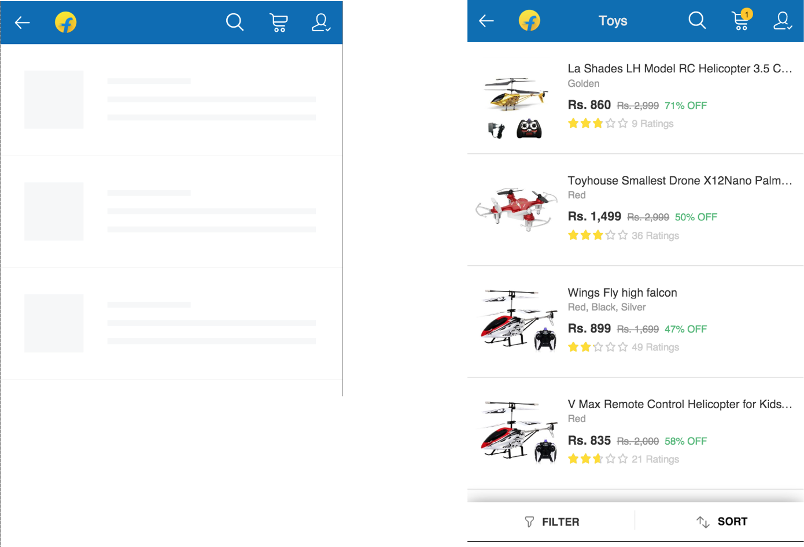

# skeleton 介绍

在页面渲染过程中，首先让用户看到页面的大致框架，感知到页面正在加载，然后看到页面元素被逐渐渲染出来，总要好过面对长时间的白屏。这里页面中的这个“大致框架”就是 skeleton，起到占位作用，随后会被最终渲染完毕的页面元素替换掉。

[flipkart就采用了这样的做法](http://tech-blog.flipkart.net/2016/03/)，虽然此时用户还无法正常与顶部导航栏进行交互，但不至于面对白屏迅速失去耐心。

受[Ele.me升级至PWA](https://medium.com/elemefe/upgrading-ele-me-to-progressive-web-app-2a446832e509)一文启发，我们在构建时使用 Vue 的服务端渲染功能生成一个固定的 skeleton 路由组件，将渲染结果插入 html 模版中。这样 service worker 对 html 进行缓存后，skeleton 展示速度很快。

## 开发调试

在开发环境中，skeleton 对应的路由组件位于`pages/Skeleton.vue`，通过`/skeleton`路由即可访问。我们在`router.js`中使用了占位符，只有在开发环境中才会插入这个路由，所以不用担心在生产环境中被用户访问到。

由于 skeleton 中包含的代码和样式都会内联在最终的 html 中，所以应该尽可能保持 skeleton 结构和样式的精简。
如无必要，尽量不要使用 vuetify 的组件，这会导致输出大量样式规则。

## 后续改进

由于我们的模版项目是一个单页面项目，构建时生成的 skeleton 只有一个。
对于一个简单应用尚可接受，但是对于一个复杂应用，这样做的缺点是很明显的，当多个页面差异很大，例如搜索页可能并不需要顶部的导航条，而 skeleton 却统一渲染了出来，又或者页面的占位图差别巨大，用户会明显感知到这种差异。

改进方法有两种：
1. 使用多页应用架构，每个页面入口对应一个 skeleton。Ele.me就采用了这种办法，可以看到主页和商家页面使用了不同的 skeleton。
2. 使用服务端渲染，部分关键页面的路由渲染对应不同的 skeleton，[flipkart](http://tech-blog.flipkart.net/2016/03/)采用了这种方式。

