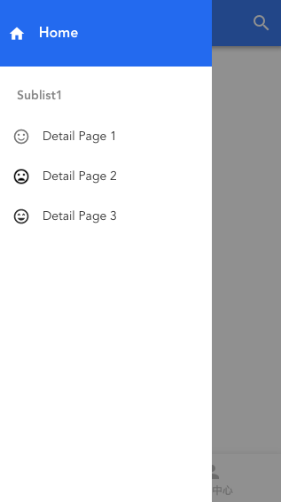

# App Shell 调整及扩展

## App Shell 模型

App Shell 架构是构建 PWA 应用的一种方式，它通常提供了一个最基本的 Web App 框架，包括应用的头部、底部、菜单栏等结构。顾名思义，我们可以把它理解成应用的一个「空壳」，这个「空壳」仅包含页面框架所需的最基本的 HTML 片段，CSS 和 javaScript，这样一来，用户重复打开应用时就能迅速地看到 Web App 的基本界面，只需要从网络中请求、加载必要的内容。我们使用 Service Worker 对 App Shell 做离线缓存，以便它可以在离线时正常展现，达到类似 Native App 的体验。

譬如项目的简单示例：新闻 Demo，就演示了这一架构，我们将头部及导航栏作为 Shell，其余部分为动态更新的内容，如下图。


开发一个 App Shell, 我们通常要注意以下几点：

- 将动态内容与 Shell 分离

- 尽可能使用较少的数据，实现快速加载

- 使用本地缓存中的静态资源

明确以上内容之后，我们就可以着手开发、定制自己的 App Shell 了。

## 调整及扩展 App Shell

我们可以从零开始开发自己的 App Shell，但为了降低开发成本，Lavas 已经准备好了一个比较通用的 App Shell，我们可以直接使用它，也可以在它的基础上进行调整及扩展。

在 [Lavas 的命令行工具](https://github.com/lavas-project/lavas) 提供的多种类型模板中，我们选择 `App Shell` 模板，
它集成的 App Shell 包含了典型的页面头部、页面底部导航、侧边展开栏等基本结构，如下图所示。




整个 App Shell 结构由不同的组件组成，在 `src/components` 目录中进行管理。

```bash
src/components
    ├── AppBottomNavigator.vue
    ├── AppHeader.vue
    ├── AppMask.vue
    ├── AppSidebar.vue
    ├── ProgressBar.vue
    └── Sidebar.vue
```

### 状态管理

为了方便 App Shell 与页面之间的交互，我们将 App Shell 各组件的状态放在 [vuex](https://vuex.vuejs.org/zh-cn/intro.html) 的 store 中统一管理，具体实现在 `src/store/modules/app-shell.js`， 它将 Shell 各组件划分成不同的 modules，包含了组件的 state, actions, mutations 等信息。这样一来，页面组件可以通过 `mapStates/mapActions` 访问当前 store 的状态及提交修改操作。

以 `AppHeader` （页面头部）组件举例，我们在 store 中已经给头部定义了一些状态：

| state    | @type   | 含义             |
| :---:    | :-----: | :-------------: |
| show     | boolean | 是否展示顶部导航栏 |
| title    | string  | 标题内容 |
| logoIcon | string  | logo图标名称 |
| showMenu | boolean | 是否展示左侧菜单图标 |
| showBack | boolean | 是否展示左侧返回图标 |
| showLogo | boolean | 是否展示左侧logo |
| actions  | Array   | 右侧操作按钮数组 |

通常各个的路由组件页面对头部都有定制化需求，例如在详情页，我们需要将头部原有的`菜单`、`搜索` ，分别替换成`后退`、`首页` ，只需要调用 `AppHeader` store 中定义的 `setAppHeader` action 去改变相应状态即可。

```js
// 页面组件中
import {mapActions} from 'vuex';

export default {
    name: 'detail',
    methods: {
        ...mapActions('appShell/appHeader', [
            'setAppHeader'
        ]),
        ...mapActions('appShell/appBottomNavigator', [
            'hideBottomNav'
        ])
    },
    created() {
        this.setAppHeader({
            show: true,
            title: 'Lavas Detail',
            showMenu: false,
            showBack: true,
            showLogo: false,
            actions: [
                {
                    icon: 'home',
                    route: {
                        name: 'home'
                    }
                }
            ]
        });
        this.hideBottomNav();
    }
};
```

其他 Shell 组件的情况也大同小异，我们可以根据自己的需求进行类似的调整和修改。

### 与路由组件通信

App Shell 和页面路由组件之间的通信是通过全局事件总线 EventBus 来实现的，具体实现中，App Shell 组件使用不同的命名空间触发事件，各页面路由组件在 activated 函数中进行监听，并处理自己的页面逻辑。

```js
// App shell 组件中，发送全局事件，便于非父子关系的路由组件监听
EventBus.$emit(`app-header:click-menu`, eventData);
```

```js
// 页面路由组件，在 activated 钩子中注册
activated() {
    EventBus.$on(`app-header:click-menu`, ({data}) => {
        // 处理点击按钮事件
        // ...
    });
}

```

关于这部分内容，在 [开发一个页面](https://lavas.baidu.com/guide/vue/doc/vue/foundation/how-to-add-a-page#与-app-shell-的交互) 中也有介绍。

### 扩展 Shell

如果要对 App Shell 进行扩展，我们首先要在 `src/components` 目录下新增组件的内容。如果有必要，还要在 `app-shell` 状态树下增加相应的 module 进行管理。同时别忘了，App Shell 的组件都在主页面 `src/App.vue` 中导入使用，我们需要在这里引用新增的组件。

```html
<!--> src/App.vue <-->
<template>
    <div id="app">
        <div class="app-shell">
            <app-header
                class="app-shell-header"
                @click-menu="handleClickHeaderMenu"
                @click-back="handleClickHeaderBack"
            >
                <template slot="logo"></template>
            </app-header>
        </div>
    </div>
</template>

<script>
import Vue from 'vue';
import {mapState, mapActions} from 'vuex';
import AppHeader from '@/components/AppHeader';

export default {
    name: 'app',
    components: {
        AppHeader
    }
};
</script>
```

## 小结

你可以结合 [Lavas Github](https://github.com/lavas-project) 给出的 [lavas-template-vue-appshell](https://github.com/lavas-project/lavas-template-vue-appshell) 更清晰地了解 Lavas 模板提供的 App Shell 结构。或者，通过 [架构-App Shell 模型](https://lavas.baidu.com/doc/architecture/the-app-shell-model) 这篇文章，了解更多有关 App Shell 的知识。