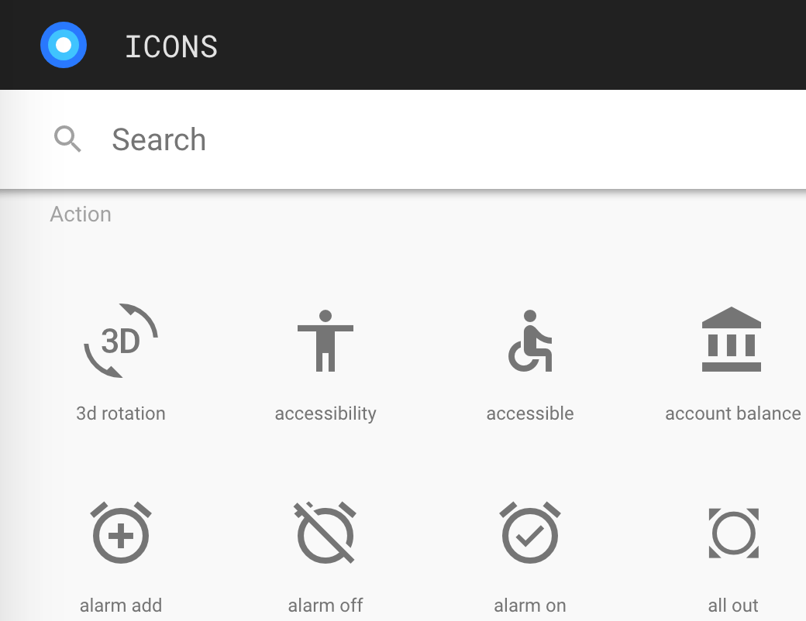

# 在项目中使用图标

> [Lavas Basic 模版](https://github.com/lavas-project/lavas-template-vue-basic)并不包含此功能

在项目中有两种使用图标的方式，可以同时使用：

1. 使用 material 字体文件

2. 引入自定义的 svg 文件

## 字体文件

[material 图标](https://material.io/icons/)能够满足大部分应用场景：


我们已经引入了 material 字体文件和所需样式表，直接使用 vuetify 中 [Icons](https://vuetifyjs.com/components/icons) 组件即可，基本方法如下：

```html
<v-icon>home</v-icon>
```

更多使用方式请参考 [Icons](https://vuetifyjs.com/components/icons) 组件文档。

## 自定义 svg

当 material 图标无法满足使用需求时，我们可以引入自定义的 svg 文件。

在 `config/icon.js` 配置文件中定义前缀和存放 svg 的文件夹：

```js
{
    // 前缀
    prefix: 'svg-',

    // 用户自定义的svg文件夹
    svgDir: path.resolve(__dirname, '../src/assets/svg')
};
```

我们使用 [vue-awesome](https://github.com/Justineo/vue-awesome) 注册自定义的 svg 图标，使用方法如下：

1. 将 test.svg 放入配置文件中的指定文件夹下

2. 在模版中使用 `<icon name="svg-test"></icon>` ，注意此处 name 需要加上配置文件中指定的前缀

> info
>
> 在开发时向 svg 文件夹中添加图标并不需要重启开发服务器。了解更多实现原理，可以参考[ svg loader 介绍](https://lavas.baidu.com/guide/vue/doc/vue/webpack/svg-loader)。

### 可选的 fontawesome 图标

和 material 图标库一样，[fontawesome](http://fontawesome.io/icons/) 包含了大量丰富的图标：


由于 vue-awesome 已经提供了 fontawesome 中全部 svg 格式的图标，如果想使用这些图标，方法如下：

首先修改 `config/icon.js` 配置文件，在 icons 数组中添加需要的图标名称

```js
{
    prefix: 'svg-',
    svgDir: path.resolve(__dirname, '../src/assets/svg'),

    // 项目中使用的fontawesome名
    icons: [
        'envelope'
    ]
}
```

然后使用方法与自定义 svg 相同，只是不需要加前缀：`<icon name="envelope"></icon>`。

> info
>
> 我们只会引入 icons 中指定的 fontawesome svg，不用担心会引入全集。
