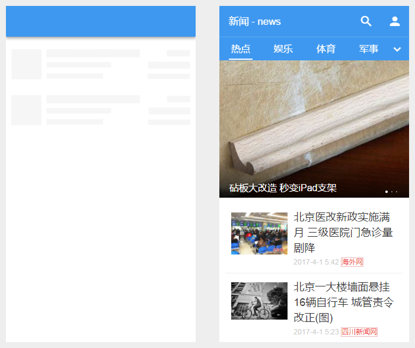
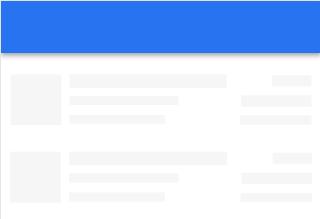

# App Skeleton 介绍

在使用 Native APP 时我们经常可以看到在实际内容加载出来之前会有一些 `占位图片`，因为其结构和实际加载内容相似(如新闻页面加载之前也会有一个纵向列表)，因此让用户感知到自己的页面正在加载中，体验较好。而传统的 Web 站点因为无法实现这一点，在加载前统一为白屏，我们能优化的仅仅是缩短这个 `白屏时间`，这就决定了 Web App 相较于 Native APP 在用户体验上的先天劣势。

我们把这个 `占位图片` 称为 `skeleton` 。通过 PWA 的缓存机制，我们现在已经有能力让 Skeleton 也出现在 Web App 上取代白屏。在了解具体细节之前，我们先观察一个由 Lavas 生成的示例的效果图。



受 [ele.me 升级至 PWA](http://geek.csdn.net/news/detail/210535) 一文启发，我们采取的实现方法大致是：

1. 在构建时将一个固定的 Skeleton 路由组件的渲染结果插入 HTML 模板中
2. 在 Service Worker 中配置其对包含 Skeleton 的 HTML 进行缓存
3. 页面切换时直接读取缓存获取包含 Skeleton 的 HTML，大大缩短甚至去除白屏时间

## Lavas 的 Skeleton 支持

以提升 Web App 用户体验为核心的 PWA 自然应该将 Skeleton 纳入考虑范围，因此 Lavas 也将 Skeleton 的支持集成到所有初始化的项目中(不论选择的是哪种模板)。因此生成的项目在切换页面时会率先渲染 Skeleton ，效果会是这样：



这里还需要注意一点：skeleton 会在页面首次进入时出现。在单页应用情况下( [Lavas Basic 模板](https://github.com/lavas-project/lavas-template-vue-basic)和 [Lavas App Shell 模板](https://github.com/lavas-project/lavas-template-vue-appshell))，因为后续页面切换均由 Vue 在前端完成，因此 Skeleton 只会在第一次进入页面时展现。而在多页应用情况下( [Lavas MPA 模板](https://github.com/lavas-project/lavas-template-vue-mpa))，Lavas 支持为每个页面都提供一个 Skeleton ，因此在每个页面之间切换都会有目标页面对应的 Skeleton 展现。

### 默认 Skeleton

首先需要指出一个大原则：Lavas 的每个模板都__已经__帮助开发者设置了默认的 Skeleton ，__不需要开发者进行任何额外的配置即可生效__。所以以下部分仅供需要了解 Skeleton 配置和运行方式，或者希望对其进行修改的开发者参考。如果你想直接使用默认的 Skeleton ，你也可以选择略过这部分。

### 代码位置和路由规则

在通过 Lavas 初始化的项目中，skeleton 是以 Vue 组件的形式存在的。以 Basic 模板为例，skeleton 位于 `pages/Skeleton.vue` 。我们可以通过路由规则 `/skeleton` 在开发模式下访问到这个组件。如果用户需要根据实际项目的不同需求(如需要区别于纵向排列的其他 Skeleton )，也可进行修改并通过路由规则预览并确认效果。__另外开发者也不用担心在构建后的生产模式代码中是不会包含这条路由规则的。__多页应用有多个 Skeleton ，因此路由规则会包含每个页面，详情可见 [多页应用的模板介绍]()

### 运行方式

我们为 Skeleton 开发了一个 webpack 插件：[vue-skeleton-webpack-plugin](https://github.com/lavas-project/vue-skeleton-webpack-plugin)。在生成的项目中，我们对它进行了如下配置：

1. 在开发环境时，我们在 `build/webpack.dev.conf.js` 中配置 `module.rules` , 将 `/skeleton` 添加到路由规则

```js
module.exports = merge(baseWebpackConfig, {
    module: {
        rules: utils.styleLoaders({sourceMap: config.dev.cssSourceMap})
            .concat(SkeletonWebpackPlugin.loader({
                entry: 'skeleton',
                routerEntry: resolve('src/router.js')
            }))
    }
    // ,
    // ...
})
```

2. 在开发环境的配置文件 `build/webpack.dev.conf.js` 和生产环境的配置文件 `build/webpack.prod.conf.js` 中配置 `plugins` 数组，将 Skeleton 的全部内容添加到 HTML 中，从而展现效果

```js
module.exports = merge(baseWebpackConfig, {
    // ...
    plugins: [
        // ...
        new SkeletonWebpackPlugin({
            webpackConfig: require('./webpack.skeleton.conf')
        }),
        // ...
    ]
})
```

在实际运行中，skeleton 的展现和消失有如下几个步骤：

1. 调用 `ssr` (依赖于 `vue-server-renderer` ，详见[这里](https://ssr.vuejs.org/zh/)) 对 Skeleton 的 Vue 组件进行服务端渲染，保存渲染完成的内容(包含 Skeleton 的所有 HTML 和 CSS )

2. 根据 webpack plugins 的配置，在 webpack 编译(`compilation`)并捕获到事件`html-webpack-plugin-before-html-processing` 时 (这个事件由 `html-webpack-plugin` 抛出，关于这个常用插件的介绍请看 [这里](https://github.com/jantimon/html-webpack-plugin)) 对编译过程中的 HTML 进行操作

3. 寻找编译过程中的 HTML 的 Vue 挂载根节点，一般是 `<div id="app">` 。将上述渲染完成的 Skeleton 内容插入到这个节点内部

4. 在用户进入页面时，因为 HTML 中已经包含了 Skeleton 渲染完成的内容，因此可以直接展现。而当 Vue 加载完成后进行挂载( mount )时，挂载根节点内的 Skeleton 内容会被替换，从而完成 Skeleton 使命

5. 在 Service Worker 中配置其对 Skeleton HTML 进行缓存，下次直接从缓存返回结果

### Lavas SSR 模板和 Skeleton

在使用服务端渲染时，由于服务端返回的 HTML 已经包含了首屏的页面结构，并不需要客户端渲染首屏内容，此时 Skeleton 就没有存在的必要了，可参考我们的 [Lavas SSR 模板](https://github.com/lavas-project/lavas-template-vue-ssr)。

### 一些注意点

1. 由于 Skeleton 中包含的代码和样式都会内联在最终的 HTML 中，所以应该尽可能保持 Skeleton 结构和样式的精简。如无必要，尽量不要在 Skeleton 中使用第三方UI组件(如 materialUI, Vuetify等)，这会导致输出大量样式规则。

2. Skeleton.vue 中已经引入了 [normalize.css](https://github.com/necolas/normalize.css/)，这就意味着在全局样式或者其他组件中都不需要重复引入了。

3. 虽然 Skeleton 本身也是个 Vue 控件，但因为采用了服务端渲染，因此省略了很多生命周期，只有 `beforeCreate` 和 `create` 会被调用。此外我们也应当避免在这两个周期钩子函数中使用全局代码，如 `setInterval` 等等。详细情况可以参考 [Vue 官网关于 SSR 的介绍](https://ssr.vuejs.org/zh/universal.html)
